**EES288用户手册** 
==================

**1 概述**
~~~~~~~~~~~~~~~
EES-288是基于Xilinx Zynq-7000 系列FPGA的最小系统板。主芯片XC7Z010CLG400-1内部含有集成处理系统(PS)和可编程逻辑资源(PL)。PS部分集成了功能丰富的两颗ARM Cortex-A9核心，同时还包含片上存储器、外部存储接口和一组丰富的I/O外设，可以灵活应用于具有FX8接口的FPGA母板。EES-288提供SD接口、UART接口以及USB 2.0接口，可以与大量外设进行通信，使其广泛应用在便携式、低功耗应用。另外还提供了一个Ethernet接口，该接口兼容IEEE 802.3标准，支持10/100/1000M传输速率,可以满足不同的网络应用开发。搭配Xilinx的ISE 软件和Vivado软件，可灵活的进行系统设计和开发，它为所有可编程SOC提供了一个硬件设计开发环境。

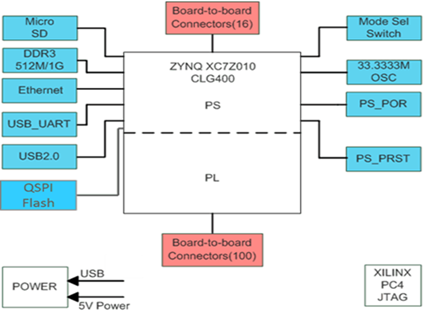

   图1  EES288电路板体系结构图
   
硬件规格：

PS

*	Zynq-7 XC7Z010-CLG400-1
*	1GB DDR3 Memory SODIMM
*	128Mb Quad SPI Flash memory
*	Secure Digital (SD) connector
*	USB-to-UART bridge
*	10/100/1000M Ethernet PHY
*	USB2.0 PHY

PL

*	2 Bit User LED
*	2个2*8 PMOD输出接口
*	2个80pin 的FX8连接器

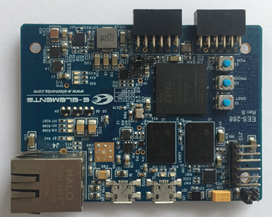

   图2 EES288实验板实物框图

**2 FPGA**
~~~~~~~~~~~~~~~
EES-288核心板上包含的主芯片xc7z010-clg400-1是基于Xilinx zynq-7000 的全可编程SOC器件。Zynq-7000系列SOC器件在单一芯片上集成了功能丰富的处理系统(PS)和可编程序逻辑(PL)资源。处理器系统包含一个功能丰富的双核ARM Cortex-A9核心，并采用了高性能、低功耗的28 nm工艺技术实现。同时，它还包含片上存储器、外部存储接口和一组丰富的I/O外设。

zynq-7000 AP SOC由以下主要功能模块构成: 处理系统(PS) 、应用处理器单元(APU)、内存接口、I/O外设(IOP)及可编程逻辑(PL)资源等。Zynq-7000系列FPGA芯片的功能模块图如下图所示：

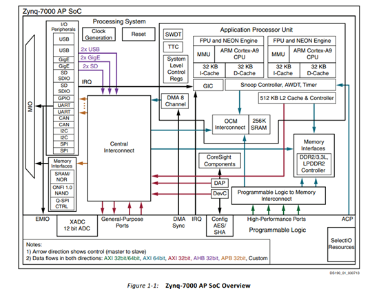

   图3 ZYNQ-7000 FPGA 功能模块图

**3 板卡供电**
~~~~~~~~~~~~~~~~
最小系统板采用USB接口提供5V的电压供电，板上提供了两个Micro-USB接口，功能分别为USB-OTG（J8）和USB-JTAG（J3），其中USB-JTAG接口可以用于为板卡供电。板卡上提供电压转换电路将USB输入的5V电压转换为板卡上各类芯片需要的工作电压。上电成功后橙色LED灯（D3）点亮。

**4 时钟模块**
~~~~~~~~~~~~~~~~~~
板上提供了一个100MHz的晶振用作系统时钟和一个33.33MHz的晶振做处理系统的时钟，分别与PL端全局时钟输入脚C17以及PS端系统时钟输入脚E7相连。

+--------------+-------------------+-----------------+
|名称          |原理图标号         |FPGA IO PIN      |
+--------------+-------------------+-----------------+
|系统时钟      |FPGA_CLK0          |K17              |
+--------------+-------------------+-----------------+
|处理器时钟    |PS_CLK             |E7               |
+--------------+-------------------+-----------------+

**5 FPGA配置**
~~~~~~~~~~~~~~~
EES288支持三种方式启动，分别是JTAG、QSPI flash以及SD card。不同启动方式的选择电路如图4所示。

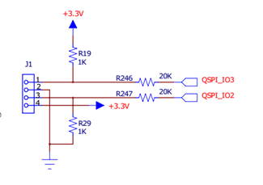

   图4 BOOT SEL电路图

表2 不同启动方式的跳线连接设置

+---------------+------------------+
|Jumber position                   |
+---------------+------------------+
|1-2            |JTAG              |
+---------------+------------------+
|2-3            |QSPI              |
+---------------+------------------+
|3-4            |SD CARD           |
+---------------+------------------+

跳线设置方法如表2所示，当跳线1和跳线2连接时，启动方式为JTAG模式，以此类推。用户可以根据自己的需要选择不同的启动方式。

**6 复位模块**
~~~~~~~~~~~~~~~~~
板上提供了三个按钮，分别实现FPGA编程复位(FPGA_PROG#)、处理系统复位(PS_SRST#)以及处理系统上电复位(PS_POR#)，具体的接口电路如图5所示：

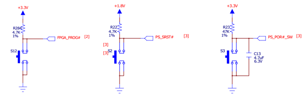

   图5 SW接口电路图

表3 SW接口与FPGA接口的连接关系

+------------+--------------------+--------------+
|U1 FPGA Pin |Schematic Net Name  |Controlled SW |
+============+====================+==============+
|C9          |PS_SRST#            |S12           |
+------------+--------------------+--------------+
|B5          |PS_POR#_SW          |S2            |
+------------+--------------------+--------------+
|B6          |PS_DIP_SW0          |S3            |
+------------+--------------------+--------------+

**7 JTAG接口**
~~~~~~~~~~~~~~~
在子板上提供了一个JTAG下载和调试的接口， JTAG的下载电路图如下图所示：

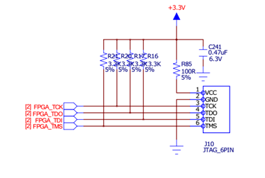

   图6 JTAG下载电路图
   
表4 JTAG接口与FPGA接口的连接关系

+-------------+-------------------+--------------------+
|U1 FPGA Pin  |Schematic Net Name |ARM JTAG Pin Number |
+=============+===================+====================+
|G11          |FPGA_TCK           |3                   |
+-------------+-------------------+--------------------+
|H13          |FPGA_TDO           |4                   |
+-------------+-------------------+--------------------+
|G14          |FPGA_TDI           |5                   |
+-------------+-------------------+--------------------+
|G12          |FPGA_TMS           |6                   |
+-------------+-------------------+--------------------+

**8 PS LED模块**
~~~~~~~~~~~~~~~~~~
电路板上提供了2个PS LED灯，具体的连接电路图如下图所示：

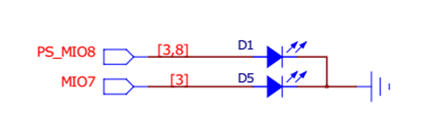

   图7  用户LED接口电路图
   
表5 PS LED接口与FPGA接口的连接关系

+------------+----------------------+---------------+
|U1 FPGA Pin |Schematic Net Name    |Controlled LED |
+============+======================+===============+
|D5          |PS_MIO8               |D1             |
+------------+----------------------+---------------+
|D8          |MIO7                  |D5             |
+------------+----------------------+---------------+ 

**9 DDR3存储模块**
~~~~~~~~~~~~~~~~~~~~
这块开发板支持三个32-bit，204脚DDR3 SODIMM模块,与xc7z010-clg400-1 SOC芯片相连，最大支持4GB容量，最快速度可达1066M/s。DDR3接口与Zynq-7000 AP SOC的IO bank相连，其电平为1.5V,是由电平转换芯片XRP6657IHBTR-F提供1.5V电压给DDR3的VDD管脚。VTT_REF则由电阻分压模块提供0.75V的电平。其引脚对应关系如下图所示：

表6	 DDR3 UDIMM与FPGA的连接关系

+--------------+---------------------+-----------------+------------------+
|U1 FPGA Pin   |Schematic Net Name   |U2 SODIMM                           |
+              +                     +-----------------+------------------+
|              |                     |Pin Number       |Pin Name          |
+--------------+---------------------+-----------------+------------------+
|C3            |DDR3_DQ00            |E3               |DQ0               |
+--------------+---------------------+-----------------+------------------+
|B3            |DDR3_DQ01            |F7               |DQ1               |
+--------------+---------------------+-----------------+------------------+
|A2            |DDR3_DQ02            |F2               |DQ2               |
+--------------+---------------------+-----------------+------------------+
|A4            |DDR3_DQ03            |F8               |DQ3               |
+--------------+---------------------+-----------------+------------------+
|D3            |DDR3_DQ04            |H3               |DQ4               |
+--------------+---------------------+-----------------+------------------+
|D1            |DDR3_DQ05            |H8               |DQ5               |
+--------------+---------------------+-----------------+------------------+
|C1            |DDR3_DQ06            |G2               |DQ6               |
+--------------+---------------------+-----------------+------------------+
|E1            |DDR3_DQ07            |H7               |DQ7               |
+--------------+---------------------+-----------------+------------------+
|E2            |DDR3_DQ08            |D7               |DQ8               |
+--------------+---------------------+-----------------+------------------+
|E3            |DDR3_DQ09            |C3               |DQ9               |
+--------------+---------------------+-----------------+------------------+
|G3            |DDR3_DQ10            |C8               |DQ10              |
+--------------+---------------------+-----------------+------------------+
|H3            |DDR3_DQ11            |C2               |DQ11              |
+--------------+---------------------+-----------------+------------------+
|J3            |DDR3_DQ12            |A7               |DQ12              |
+--------------+---------------------+-----------------+------------------+
|H2            |DDR3_DQ13            |A2               |DQ13              |
+--------------+---------------------+-----------------+------------------+
|H1            |DDR3_DQ14            |B8               |DQ14              |
+--------------+---------------------+-----------------+------------------+
|J1            |DDR3_DQ15            |A3               |DQ15              |
+--------------+---------------------+-----------------+------------------+
|P1            |DDR3_DQ16            |E3               |DQ16              |
+--------------+---------------------+-----------------+------------------+
|P3            |DDR3_DQ17            |F7               |DQ17              |
+--------------+---------------------+-----------------+------------------+
|R3            |DDR3_DQ18            |F2               |DQ18              |
+--------------+---------------------+-----------------+------------------+
|R1            |DDR3_DQ19            |F8               |DQ19              |
+--------------+---------------------+-----------------+------------------+
|T4            |DDR3_DQ20            |H3               |DQ20              |
+--------------+---------------------+-----------------+------------------+
|U4            |DDR3_DQ21            |H8               |DQ21              |
+--------------+---------------------+-----------------+------------------+
|U2            |DDR3_DQ22            |G2               |DQ22              |
+--------------+---------------------+-----------------+------------------+
|U3            |DDR3_DQ23            |H7               |DQ23              |
+--------------+---------------------+-----------------+------------------+
|V1            |DDR3_DQ24            |D7               |DQ24              |
+--------------+---------------------+-----------------+------------------+
|Y3            |DDR3_DQ25            |C3               |DQ25              |
+--------------+---------------------+-----------------+------------------+
|W1            |DDR3_DQ26            |C8               |DQ26              |
+--------------+---------------------+-----------------+------------------+
|Y4            |DDR3_DQ27            |C2               |DQ27              |
+--------------+---------------------+-----------------+------------------+
|Y2            |DDR3_DQ28            |A7               |DQ28              |
+--------------+---------------------+-----------------+------------------+
|W3            |DDR3_DQ29            |A2               |DQ29              |
+--------------+---------------------+-----------------+------------------+
|V2            |DDR3_DQ30            |B8               |DQ30              |
+--------------+---------------------+-----------------+------------------+
|V3            |DDR3_DQ31            |A3               |DQ31              |
+--------------+---------------------+-----------------+------------------+
|C2            |DDR3_LDQS0_P         |F3               |LDQS              |
+--------------+---------------------+-----------------+------------------+
|B2            |DDR3_LDQS0_N         |G3               |LDQS#             |
+--------------+---------------------+-----------------+------------------+
|G2            |DDR3_UDQS0_P         |C7               |UDQS              |
+--------------+---------------------+-----------------+------------------+
|F2            |DDR3_UDQS0_N         |B7               |UDQS#             |
+--------------+---------------------+-----------------+------------------+
|L2            |DDR3_CK_P            |J7               |CK                |
+--------------+---------------------+-----------------+------------------+
|M2            |DDR3_CK_N            |K7               |CK#               |
+--------------+---------------------+-----------------+------------------+
|N2            |DDR3_A00             |N3               |A00               |
+--------------+---------------------+-----------------+------------------+
|K2            |DDR3_A01             |P7               |A01               |
+--------------+---------------------+-----------------+------------------+
|M3            |DDR3_A02             |P3               |A02               |
+--------------+---------------------+-----------------+------------------+
|K3            |DDR3_A03             |N2               |A03               |
+--------------+---------------------+-----------------+------------------+
|M4            |DDR3_A04             |P8               |A04               |
+--------------+---------------------+-----------------+------------------+
|L1            |DDR3_A05             |P2               |A05               |
+--------------+---------------------+-----------------+------------------+
|L4            |DDR3_A06             |R8               |A06               |
+--------------+---------------------+-----------------+------------------+
|K4            |DDR3_A07             |R2               |A07               |
+--------------+---------------------+-----------------+------------------+
|K1            |DDR3_A08             |T8               |A08               |
+--------------+---------------------+-----------------+------------------+
|J4            |DDR3_A09             |R3               |A09               |
+--------------+---------------------+-----------------+------------------+
|F5            |DDR3_A10             |L7               |A10               |
+--------------+---------------------+-----------------+------------------+
|G4            |DDR3_A11             |R7               |A11               |
+--------------+---------------------+-----------------+------------------+
|E4            |DDR3_A12             |N7               |A12               |
+--------------+---------------------+-----------------+------------------+
|D4            |DDR3_A13             |T3               |A13               |
+--------------+---------------------+-----------------+------------------+
|F4            |DDR3_A14             |T7               |A14               |
+--------------+---------------------+-----------------+------------------+
|L5            |DDR3_BA0             |M2               |BA0               |
+--------------+---------------------+-----------------+------------------+
|R4            |DDR3_BA1             |N8               |BA1               |
+--------------+---------------------+-----------------+------------------+
|J5            |DDR3_BA2             |M3               |BA2               |
+--------------+---------------------+-----------------+------------------+
|F1            |DDR3_UDM0            |D3               |UDM               |
+--------------+---------------------+-----------------+------------------+
|A1            |DDR3_LDM0            |E7               |LDM               |
+--------------+---------------------+-----------------+------------------+
|Y1            |DDR3_UDM1            |D3               |UDM               |
+--------------+---------------------+-----------------+------------------+
|T1            |DDR3_LDM1            |E7               |LDM               |
+--------------+---------------------+-----------------+------------------+
|N5            |DDR3_ODT             |K1               |ODT               |
+--------------+---------------------+-----------------+------------------+
|N1            |DDR3_CS#             |L2               |CS#               |
+--------------+---------------------+-----------------+------------------+
|P5            |DDR3_CAS#            |K3               |CAS#              |
+--------------+---------------------+-----------------+------------------+
|P4            |DDR3_RAS#            |J3               |RAS#              |
+--------------+---------------------+-----------------+------------------+
|M5            |DDR3_WE#             |L3               |WE#               |
+--------------+---------------------+-----------------+------------------+
|B4            |DDR3_RESET#          |T2               |RESET#            |
+--------------+---------------------+-----------------+------------------+
|R2            |DDR3_LDQS1_P         |F3               |LDQS              |
+--------------+---------------------+-----------------+------------------+
|T2            |DDR3_LDQS1_N         |G3               |LDQS#             |
+--------------+---------------------+-----------------+------------------+
|W5            |DDR3_UDQS1_P         |C7               |UDQS              |
+--------------+---------------------+-----------------+------------------+
|W4            |DDR3_UDQS1_N         |B7               |UDQS#             |
+--------------+---------------------+-----------------+------------------+
|N3            |DDR3_CKE             |K9               |CKE               |
+--------------+---------------------+-----------------+------------------+

**10 QSPI Flash模块**
~~~~~~~~~~~~~~~~~~~~~~~
N25Q128(16 mb x 8)是一个128bit的串行闪存，具有先进的写保护机制。他是通过一个高速spi兼容的总线工作在XIP（“执行到位”）模式，这个N25Q128支持创新、高性能四/双I/O指令，这些新的指令允许双或四传输带宽为阅读和程序操作。内存可以操作的三种不同的协议为：

* 标准SPI(扩展SPI协议)
* 四I / O SPI
* 对偶I / O SPI

其读写时序如下图所示：

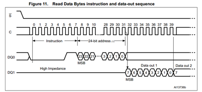

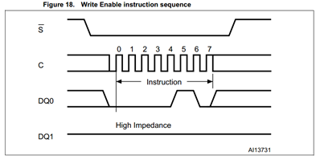

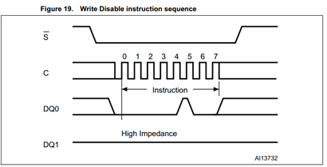

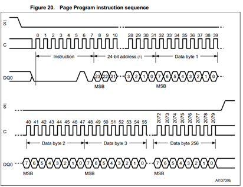
   
   图8 QSPI Flash读写时序图
   
该芯片与FPGA芯片的I/O引脚的连接关系如下原理图所示：

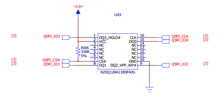
   
   图9  FLASH芯片接口原理图
   
表7 NOR FLASH与FPGA的连接关系

+---------------+-------------------+----------------+---------------+
|U1-C FPGA Pin  |Schematic Net Name |U43 BPI Flash                   |   
+               +                   +----------------+---------------+
|               |                   |Pin Number      |Pin Name       |
+---------------+-------------------+----------------+---------------+
|A5             |QSPI_CLK           |16              |CLK            |
+---------------+-------------------+----------------+---------------+
|B8             |QSPI_IO0           |15              |DQ0            |
+---------------+-------------------+----------------+---------------+
|B7             |QSPI_IO2           |9               |DQ2_VPP_WP#    |
+---------------+-------------------+----------------+---------------+
|A6             |QSPI_IO3           |1               |DQ3_HOLD#      |
+---------------+-------------------+----------------+---------------+
|A7             |QSPI_CS#           |7               |CS#            |
+---------------+-------------------+----------------+---------------+
|D6             |QSPI_IO1           |8               |DQ1            |
+---------------+-------------------+----------------+---------------+

**11 SD模块**
~~~~~~~~~~~~~~~~~
板上带有1个SD卡插槽，用于存储数据和系统启动，其电路如下图所示：

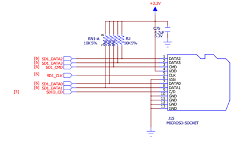
   
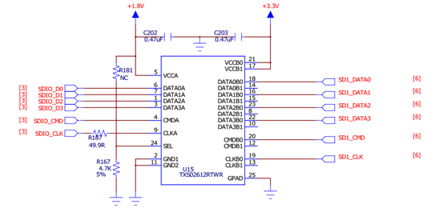
   
   图14  SD接口电路图
   
表8 SD卡接口信号与FPGA管脚连接关系

+-------------+-------------------+------------------+--------------+
|U1 FPGA Pin  |Schematic Net Name |J15 and U27 SD Module Connector  |
+             +                   +------------------+--------------+
|             |                   |Pin Number        |Pin Name      |
+-------------+-------------------+------------------+--------------+
|F13          |SD1_DATA2          |1                 |DATA2         |
+-------------+-------------------+------------------+--------------+
|B15          |SD1_DATA3          |2                 |DATA3         |
+-------------+-------------------+------------------+--------------+
|C17          |SD1_CMD            |3                 |CMD           |
+-------------+-------------------+------------------+--------------+
|D14          |SD1_CLK            |5                 |CLK           |
+-------------+-------------------+------------------+--------------+
|E12          |SD1_DATA0          |7                 |DATA0         |
+-------------+-------------------+------------------+--------------+
|A9           |AD1_DATA1          |8                 |DATA1         |
+-------------+-------------------+------------------+--------------+
|E6           |SDIO_CD            |9                 |C/D           |
+-------------+-------------------+------------------+--------------+

**12 UART模块**
~~~~~~~~~~~~~~~~~~
UART接口由发送TX和接收RX信号构成，同时通过USB-UART的转换芯片CP2102实现与PC机的USB连接。由于连接到SoC的串口I/O引脚电平为1.8V，因而通过电平转换芯片SN74AVC2T245RSWR实现3.3V和1.8V的电平转换。具体电路如下图所示：

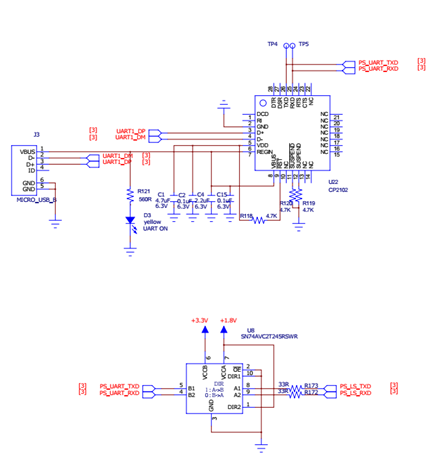
   
   图11  UART接口电路图
   
表9 UART接口信号与FPGA管脚连接关系

+-------------------+---------------------+----------------------------+
|U1 FPGA Pin        |Schematic Net Name   |U8 Pin Number               |
+-------------------+---------------------+----------------------------+
|B12                |PS_LS_TXD            |8                           |
+-------------------+---------------------+----------------------------+
|C12                |PS_LS_RXD            |9                           |
+-------------------+---------------------+----------------------------+

**13 USB 2.0模块**
~~~~~~~~~~~~~~~~~~~
板上集成一个USB 2.0的PHY芯片，该芯片与xc7z010-clg400-1内的USB 2.0 ULPI收发器构成USB host/device 以及USB OTG的功能。

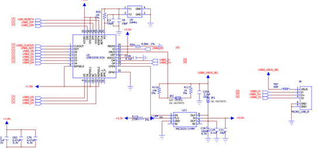
   
   图12  USB接口电路图
   
表10 USB接口信号与FPGA管脚连接关系

+---------------+-------------------+----------------+--------------+
|U1-C FPGA Pin  |Schematic Net Name |U5 USB3320C                    |
+               +                   +----------------+--------------+
|               |                   |Pin Number      |Pin Name      |
+---------------+-------------------+----------------+--------------+
|A11            |USB0_CLKOUT        |1               |CLKOUT        |
+---------------+-------------------+----------------+--------------+
|E16            |USB0_NXT           |2               |NXT           |
+---------------+-------------------+----------------+--------------+
|A14            |USB0_D0            |3               |D0            |
+---------------+-------------------+----------------+--------------+
|D15            |USB0_D1            |4               |D1            |
+---------------+-------------------+----------------+--------------+
|A12            |USB0_D2            |5               |D2            |
+---------------+-------------------+----------------+--------------+
|F12            |USB0_D3            |6               |D3            |
+---------------+-------------------+----------------+--------------+
|C16            |USB0_D4            |7               |D4            |
+---------------+-------------------+----------------+--------------+
|A10            |USB0_D5            |9               |D5            |
+---------------+-------------------+----------------+--------------+
|E13            |USB0_D6            |10              |D6            |
+---------------+-------------------+----------------+--------------+
|C18            |USB0_D7            |13              |D7            |
+---------------+-------------------+----------------+--------------+
|D16            |USB0_RESET#        |27              |RESET#        |
+---------------+-------------------+----------------+--------------+
|C15            |USB0_STP           |29              |USB0_STP      |
+---------------+-------------------+----------------+--------------+
|C13            |USB0_DIR           |31              |USB0_DIR      |
+---------------+-------------------+----------------+--------------+

**14 Ethernet接口**
~~~~~~~~~~~~~~~~~~~~~
实验平台上包含一个 Mavell Alaska 的以太网PHY(88E1116R) 接口, Ultra 88E1111 是一个以太网物理层器件PHY，可以10/100/1000 Mb/s的速率运行,PHY芯片的差分输入输出数据信号和一个Halo HFJ11-1-1G01-E RJ-45的连接器相连,以此将其连接到外部的以太网络上，另一方面，PHY器件的并行数据输入输出信号和一些控制信号与FPGA连接，通过FPGA片内设计MAC层和IP层以及配套的逻辑，可以接收从PHY来的物理层数据并进行处理和传递，同时也可以将上层的数据经处理后传送到PHY器件再传送到网路上，外部提供了一个25MHz的时钟输入，在上电或复位以后接口有一个缺省的设置，这些设置也可以通过FPGA的控制逻辑来改变。下图是以太网接口的电路图。

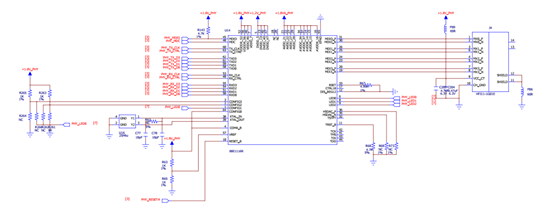
   
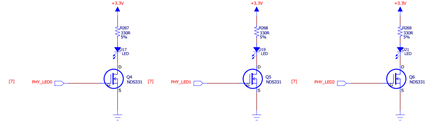
   
   图13  PHY接口电路图
   
表11 PHY接口信号与FPGA管脚连接关系

+---------------+-------------------+----------------+--------------+
|U1 FPGA Pin    |Schematic Pin Name |U14 M88E1111                   |
+               +                   +----------------+--------------+
|               |                   |Pin Number        |Pin Name    |
+---------------+-------------------+----------------+--------------+
|A19            |PHY_TX_CLK         |60              |TX_CLK        |
+---------------+-------------------+----------------+--------------+
|F14            |PHY_TX_CTRL        |63              |TX_CTRL       |
+---------------+-------------------+----------------+--------------+
|B17            |PHY_RX_CLK         |53              |RX_CLK        |
+---------------+-------------------+----------------+--------------+
|D13            |PHY_RX_CTRL        |49              |RX_CTRL       |
+---------------+-------------------+----------------+--------------+
|A17            |PHY_TX_D3          |62              |TXD3          |
+---------------+-------------------+----------------+--------------+
|D10            |PHY_TX_D2          |61              |TXD2          |
+---------------+-------------------+----------------+--------------+
|B18            |PHY_TX_D1          |59              |TXD1          |
+---------------+-------------------+----------------+--------------+
|E14            |PHY_TX_D0          |58              |TXD0          |
+---------------+-------------------+----------------+--------------+
|               |PHY_LED0           |6               |LED0          |
+---------------+-------------------+----------------+--------------+
|               |PHY_LED1           |8               |LED1          |
+---------------+-------------------+----------------+--------------+
|B14            |PHY_RESET#         |10              |RESET_B       |
+---------------+-------------------+----------------+--------------+
|C10            |PHY_MDC            |45              |MDIO          |
+---------------+-------------------+----------------+--------------+
|C11            |PHY_MDIO           |48              |MDC           |
+---------------+-------------------+----------------+--------------+
|               |PHY_LED2           |9               |LED2          |
+---------------+-------------------+----------------+--------------+
|A15            |PHY_RX_D3          |55              |RXD3          |
+---------------+-------------------+----------------+--------------+
|F15            |PHY_RX_D2          |54              |RXD2          |
+---------------+-------------------+----------------+--------------+
|A16            |PHY_RX_D1          |51              |RXD1          |
+---------------+-------------------+----------------+--------------+
|D11            |PHY_RX_D0          |50              |RXD0          |
+---------------+-------------------+----------------+--------------+

**15 GPIO扩展接口**
~~~~~~~~~~~~~~~~~~~~~~
在子板上含有两个2x6 pin GPIO扩展口，接口电路图如下图所示：

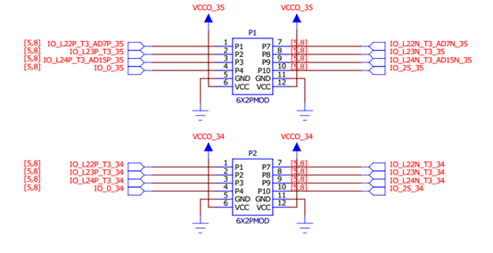
   
   图14  PMOD接口电路图
   
表12  PMOD接口与FPGA接口的连接关系

+----------------+--------------------+--------------------------+
|U1 FPGA Pin     |Schematic Net Name  |PMOD Connector Pin Number |
+----------------+--------------------+--------------------------+
|L14             |IO_L22P_T3_AD7P_35  |1(P1)                     |
+----------------+--------------------+--------------------------+
|M14             |IP_L23P_T3_35       |2(P1)                     |
+----------------+--------------------+--------------------------+
|K16             |IO_L24P_T3_AD15P_35 |3(P1)                     |
+----------------+--------------------+--------------------------+
|G14             |IO_0_35             |4(P1)                     |
+----------------+--------------------+--------------------------+
|L15             |IO_L22N_T3_AD7N_35  |7(P1)                     |
+----------------+--------------------+--------------------------+
|M15             |IO_L23N_T3_35       |8(P1)                     |
+----------------+--------------------+--------------------------+
|J16             |IO_L24P_T3_AD15N_35 |9(P1)                     |
+----------------+--------------------+--------------------------+
|J15             |IO_25_35            |10(P1)                    |
+----------------+--------------------+--------------------------+
|W18             |10_L22P_T3_34       |1(P2)                     |
+----------------+--------------------+--------------------------+
|N17             |IO_L23P_T3_34       |2(P2)                     |
+----------------+--------------------+--------------------------+
|P15             |IO_L24P_T3_34       |3(P2)                     |
+----------------+--------------------+--------------------------+
|R19             |IO_0_34             |4(P2)                     |
+----------------+--------------------+--------------------------+
|W19             |IO_L22N_T3_34       |7(P2)                     |
+----------------+--------------------+--------------------------+
|P18             |IO_L23N_T3_34       |8(P2)                     |
+----------------+--------------------+--------------------------+
|P16             |IO_L24N_T3_34       |9(P2)                     |
+----------------+--------------------+--------------------------+
|T19             |IO_25_34            |10(P2)                    |
+----------------+--------------------+--------------------------+

**16 FX8 Connector模块**
~~~~~~~~~~~~~~~~~~~~~~~~~~
FX8扩展I/O输出的连接器电路如图所示，该模块提供了100个有效逻辑I/O口以及10个处理系统I/O口输出，其余管脚提供5.0V、3.3V以及1.8V的供电输出，用户可以通过具有FX8的外设板进行功能的扩展。

 .. figure:: _static/151.png
   :width: 70%
   :align: center
   
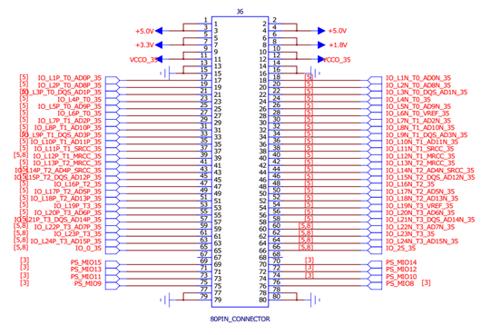
   
   图15 FX8接口电路图
   
表13 FX8接口与FPGA接口的连接关系

+-----------------+------------------------+----------------------+
|U1 FPGA Pin      |Schematic Net Name      |J5-J6 Pin Number      |
+-----------------+------------------------+----------------------+
|T11              |IO_L1P_T0_34            |17(J5)                |
+-----------------+------------------------+----------------------+
|T10              |IO_L1N_T0_34            |18(J5)                |
+-----------------+------------------------+----------------------+
|T12              |IO_L2P_T0_34            |19(J5)                |
+-----------------+------------------------+----------------------+
|U12              |IO_L2N_T0_34            |20(J5)                |
+-----------------+------------------------+----------------------+
|U13              |IO_L3P_T0_DQS_PUDC_B_34 |21(J5)                |
+-----------------+------------------------+----------------------+
|V13              |IO_L3N_T0_DQS_PUDC_B_34 |22(J5)                |
+-----------------+------------------------+----------------------+
|V12              |IO_L4P_T0_34            |23(J5)                |
+-----------------+------------------------+----------------------+
|W13              |IO_L4N_TO_34            |24(J5)                |
+-----------------+------------------------+----------------------+
|T4               |IO_L5P_TO_34            |25(J5)                |
+-----------------+------------------------+----------------------+
|T15              |IO_L5N_TO_34            |26(J5)                |
+-----------------+------------------------+----------------------+
|P14              |IO_L6P_TO_34            |27(J5)                |
+-----------------+------------------------+----------------------+
|R14              |IO_L6N_TO_34            |28(J5)                |
+-----------------+------------------------+----------------------+
|Y16              |IO_L7P_T1_34            |29(J5)                |
+-----------------+------------------------+----------------------+
|Y17              |IO_L7N_T1_34            |30(J5)                |
+-----------------+------------------------+----------------------+
|W14              |IO_L8P_T1_34            |31(J5)                |
+-----------------+------------------------+----------------------+
|Y14              |IO_L8N_T1_34            |32(J5)                |
+-----------------+------------------------+----------------------+
|T16              |IO_L9P_T1_34            |33(J5)                |
+-----------------+------------------------+----------------------+
|U17              |IO_L9N_T1_34            |34(J5)                |
+-----------------+------------------------+----------------------+
|V15              |IO_L10P_T1_34           |35(J5)                |
+-----------------+------------------------+----------------------+
|W15              |IO_L10N_T1_34           |36(J5)                |
+-----------------+------------------------+----------------------+
|U14              |IO_L11P_T1_SRCC_34      |37(J5)                |
+-----------------+------------------------+----------------------+
|U15              |IO_L11N_T1_SRCC_34      |38(J5)                |
+-----------------+------------------------+----------------------+
|U18              |IO_L12P_T1_MRCC_34      |39(J5)                |
+-----------------+------------------------+----------------------+
|U19              |IO_L12N_T1_MRCC_34      |40(J5)                |
+-----------------+------------------------+----------------------+
|N18              |IO_L13P_T2_MRCC_34      |41(J5)                |
+-----------------+------------------------+----------------------+
|P19              |IO_L13N_T2_MRCC_34      |42(J5)                |
+-----------------+------------------------+----------------------+
|N20              |IO_L14P_T2_SRCC_34      |43(J5)                |
+-----------------+------------------------+----------------------+
|P20              |IO_L14N_T2_SRCC_34      |44(J5)                |
+-----------------+------------------------+----------------------+
|T20              |IO_L15P_T2_DQS_34       |45(J5)                |
+-----------------+------------------------+----------------------+
|U20              |IO_L15N_T2_DQS_34       |46(J5)                |
+-----------------+------------------------+----------------------+
|V20              |IO_L16P_T2_34           |47(J5)                |
+-----------------+------------------------+----------------------+
|W20              |IO_L16N_T2_34           |48(J5)                |
+-----------------+------------------------+----------------------+
|Y18              |IO_L17P_T2_34           |49(J5)                |
+-----------------+------------------------+----------------------+
|Y19              |IO_L17N_T2_34           |50(J5)                |
+-----------------+------------------------+----------------------+
|V16              |IO_L18P_T2_34           |51(J5)                |
+-----------------+------------------------+----------------------+
|W16              |IO_L18N_T2_34           |52(J5)                |
+-----------------+------------------------+----------------------+
|R16              |IO_L19P_T3_34           |53(J5)                |
+-----------------+------------------------+----------------------+
|R17              |IO_L19N_T3_34           |54(J5)                |
+-----------------+------------------------+----------------------+
|T17              |IO_L20P_T3_34           |55(J5)                |
+-----------------+------------------------+----------------------+
|R18              |IO_L20N_T3_34           |56(J5)                |
+-----------------+------------------------+----------------------+
|V17              |IO_L21P_T3_DQS_34       |57(J5)                |
+-----------------+------------------------+----------------------+
|V18              |IO_L21N_T3_DQS_34       |58(J5)                |
+-----------------+------------------------+----------------------+
|W18              |IO_L22P_T3_34           |59(J5)                |
+-----------------+------------------------+----------------------+
|W19              |IO_L22N_T3_34           |60(J5)                |
+-----------------+------------------------+----------------------+
|N17              |IO_L23P_T3_34           |61(J5)                |
+-----------------+------------------------+----------------------+
|P18              |IO_L23N_T3_34           |62(J5)                |
+-----------------+------------------------+----------------------+
|P15              |IO_L24P_T3_34           |63(J5)                |
+-----------------+------------------------+----------------------+
|P16              |IO_L24N_T3_34           |64(J5)                |
+-----------------+------------------------+----------------------+
|R19              |IO_0_34                 |65(J5)                |
+-----------------+------------------------+----------------------+
|T19              |IO_25_34                |66(J5)                |
+-----------------+------------------------+----------------------+
|B13              |PS_MIO50                |74(J5)                |
+-----------------+------------------------+----------------------+
|B9               |PS_MIO51                |76(J5)                |
+-----------------+------------------------+----------------------+
|C20              |IO_L1P_T0_ADDP_35       |17(J6)                |
+-----------------+------------------------+----------------------+
|B20              |IO_L1N_T0_ADDP_35       |18(J6)                |
+-----------------+------------------------+----------------------+
|B19              |IO_L2P_T0_AD8P_35       |19(J6)                |
+-----------------+------------------------+----------------------+
|A20              |IO_L2N_T0_AD8N_35       |20(J6)                |
+-----------------+------------------------+----------------------+
|E17              |IO_L3P_T0_DQS_AD1P_35   |21(J6)                |
+-----------------+------------------------+----------------------+
|D18              |IO_L3N_T0_DQS_AD1N_35   |22(J6)                |
+-----------------+------------------------+----------------------+
|D19              |IO_L4P_T0_35            |23(J6)                |
+-----------------+------------------------+----------------------+
|D20              |IO_L4N_T0_35            |24(J6)                |
+-----------------+------------------------+----------------------+
|E18              |IO_L5P_T0_AD9P_35       |25(J6)                |
+-----------------+------------------------+----------------------+
|E19              |IO_L5N_TO_AD9N_35       |26(J6)                |
+-----------------+------------------------+----------------------+
|F16              |IO_L6P_T0_35            |27(J6)                |
+-----------------+------------------------+----------------------+
|F17              |IO_L6N_T0_35            |28(J6)                |
+-----------------+------------------------+----------------------+
|M19              |IO_L7P_T1_AD2P_35       |29(J6)                |
+-----------------+------------------------+----------------------+
|M20              |IO_L7N_T1_AD2N_35       |30(J6)                |
+-----------------+------------------------+----------------------+
|M17              |IO_L18P_T1_AD10P_35     |31(J6)                |
+-----------------+------------------------+----------------------+
|M18              |IO_L18N_T1_AD10P_35     |32(J6)                |
+-----------------+------------------------+----------------------+
|L19              |IO_L9P_T1_DQS_AD3P_35   |33(J6)                |
+-----------------+------------------------+----------------------+
|L20              |IO_L9NT1_DQS_AD3N_35    |34(J6)                |
+-----------------+------------------------+----------------------+
|K19              |IO_L10P_T1_AD11P_35     |35(J6)                |
+-----------------+------------------------+----------------------+
|J19              |IO_L10N_T1_AD11N_35     |36(J6)                |
+-----------------+------------------------+----------------------+
|L16              |IO_L11P_T1_SRCC_35      |37(J6)                |
+-----------------+------------------------+----------------------+    
|L17              |IO_L11N_T1_SRCC_35      |38(J6)                |
+-----------------+------------------------+----------------------+
|K17              |IO_L2P_T1_MRCC_35       |39(J6)                |
+-----------------+------------------------+----------------------+
|K18              |IO_L2N_T1_MRCC_35       |40(J6)                |
+-----------------+------------------------+----------------------+
|H16              |IO_L13P_T2_MRCC_35      |41(J6)                |
+-----------------+------------------------+----------------------+
|H17              |IO_L13N_T2_MRCC_35      |42(J6)                |
+-----------------+------------------------+----------------------+
|J18              |IO_L14P_T2_AD4P_SRCC_35 |43(J6)                |
+-----------------+------------------------+----------------------+
|H18              |IO_L14N_T2_AD4N_SRCC_35 |44(J6)                |
+-----------------+------------------------+----------------------+
|F19              |IO_L15P_T2_DQS_AD12P_35 |45(J6)                |
+-----------------+------------------------+----------------------+
|F20              |IO_L15N_T2_DQS_AD12N_35 |46(J6)                |
+-----------------+------------------------+----------------------+
|G17              |IO_L16P_T2_35           |47(J6)                |
+-----------------+------------------------+----------------------+
|G18              |IO_L16N_T2_35           |48(J6)                |
+-----------------+------------------------+----------------------+
|J20              |IO_L17P_T2_AD5P_35      |49(J6)                |
+-----------------+------------------------+----------------------+
|H20              |IO_L17N_T2_AD5N_35      |50(J6)                |
+-----------------+------------------------+----------------------+
|G19              |IO_L18P_T2_AD13P_35     |51(J6)                |
+-----------------+------------------------+----------------------+
|G20              |IO_L18N_T2_AD13N_35     |52(J6)                |
+-----------------+------------------------+----------------------+
|H15              |IO_L19P_T3_35           |53(J6)                |
+-----------------+------------------------+----------------------+
|G15              |IO_L19N_T3_35           |54(J6)                |
+-----------------+------------------------+----------------------+
|K14              |IO_L20P_T3_AD6P_35      |55(J6)                |
+-----------------+------------------------+----------------------+
|J14              |IO_L20N_T3_AD6N_35      |56(J6)                |
+-----------------+------------------------+----------------------+
|N15              |IO_L21P_T3_DQS_AD14P_35 |57(J6)                |
+-----------------+------------------------+----------------------+
|N16              |IO_L21N_T3_DQS_AD14N_35 |58(J6)                |
+-----------------+------------------------+----------------------+
|L14              |IO_L22P_T3_AD7P_35      |59(J6)                |
+-----------------+------------------------+----------------------+
|L15              |IO_L22N_T3_AD7N_35      |60(J6)                |
+-----------------+------------------------+----------------------+
|M14              |IO_L23P_T3_35           |61(J6)                |
+-----------------+------------------------+----------------------+
|M15              |IO_L23N_T3_35           |62(J6)                |
+-----------------+------------------------+----------------------+
|K16              |IO_L24P_T3_AD15P_35     |63(J6)                |
+-----------------+------------------------+----------------------+
|J16              |IO_L24N_T3_AD15N_35     |64(J6)                |
+-----------------+------------------------+----------------------+
|G14              |IO_0_35                 |65(J6)                |
+-----------------+------------------------+----------------------+
|J15              |IO_25_35                |66(J6)                |
+-----------------+------------------------+----------------------+
|C8               |PS_MIO15                |69(J6)                |
+-----------------+------------------------+----------------------+
|C5               |PS_MIO14                |70(J6)                |
+-----------------+------------------------+----------------------+
|E8               |PS_MIO13                |71(J6)                |
+-----------------+------------------------+----------------------+
|D9               |PS_MIO12                |72(J6)                |
+-----------------+------------------------+----------------------+
|C6               |PS_MIO11                |73(J6)                |
+-----------------+------------------------+----------------------+
|E9               |PS_MIO10                |74(J6)                |
+-----------------+------------------------+----------------------+
|B5               |PS_MIO9                 |75(J6)                |
+-----------------+------------------------+----------------------+
|D5               |PS_MIO8                 |76(J6)                |
+-----------------+------------------------+----------------------+

**17 EES353（底板）**
~~~~~~~~~~~~~~~~~~~~~~

**17.1 概述**
>>>>>>>>>>>>>>>
EES-353是依元素科技研制的可兼容基于A7的核心板EES-303的底板。该底板具有4个PMOD接口，2组2×23p的双排母接口用于IO功能扩展。产品外观如下图所示。

.. figure:: _static/16.png
   :width: 70%
   :align: center   

对应的各功能接插件如下表所示：

+-------------+---------------------------+---------------------------+
|编号         |描述                       |位号                       |
+-------------+---------------------------+---------------------------+
|1            |2个FX8接插件               |J5、J6                     |
+-------------+---------------------------+---------------------------+
|2            |4个PMOD接口                |P1、P2、P3、P4             |
+-------------+---------------------------+---------------------------+
|3            |2个2x23p的排母             |J7、J8                     |
+-------------+---------------------------+---------------------------+
|4            |DC电源输入接口             |J3                         |
+-------------+---------------------------+---------------------------+
|5            |microUSB接口供电           |J1                         |
+-------------+---------------------------+---------------------------+

EES353和EES288配合使用示意图如下图所示：

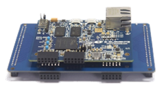

**17.2 注意事项**
>>>>>>>>>>>>>>>>>>
在EES-353的使用过程中，要特别注意以下几点：

* 工作电压不超过5V，以免烧坏；
* Fx8、PMOD等所有接插件的部分PIN脚为电源和GND，使用时应避免短路造成核心板损坏。
* J1的microUSB可用于供电，不可用于USB信号传输。

**17.3 与ZYNQ核心板互联时管脚信号对应连接关系**
>>>>>>>>>>>>>>>>>>>>>>>>>>>>>>>>>>>>>>>>>>>>>>>
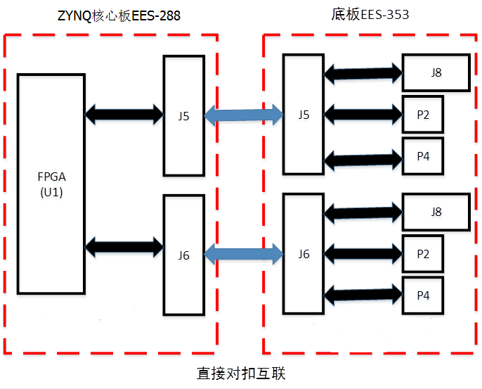

**17.4 底板EES353的内部接口映射关系表**
>>>>>>>>>>>>>>>>>>>>>>>>>>>>>>>>>>>>>>>>>>>>

+----------+----------+----------+----------+----------+----------+----------+----------+
|EES-353的J5                                |EES-353的J6                                |
+----------+----------+----------+----------+----------+----------+----------+----------+
|序号      |信号名    |序号      |信号名    |信号      |信号名    |信号      |信号名    |
+----------+----------+----------+----------+----------+----------+----------+----------+
|1         |5.0V      |2         |5.0V      |1         |5.0V      |2         |5.0V      |
+----------+----------+----------+----------+----------+----------+----------+----------+
|3         |5.0V      |4         |5.0V      |3         |5.0V      |4         |5.0V      |
+----------+----------+----------+----------+----------+----------+----------+----------+
|5         |3.3V      |6         |NC        |5         |3.3V      |6         |NC        |
+----------+----------+----------+----------+----------+----------+----------+----------+
|7         |3.3V      |8         |NC        |7         |3.3V      |8         |NC        |
+----------+----------+----------+----------+----------+----------+----------+----------+
|9         |NC        |10        |NC        |9         |NC        |10        |NC        |
+----------+----------+----------+----------+----------+----------+----------+----------+
|11        |NC        |12        |NC        |11        |NC        |12        |NC        |
+----------+----------+----------+----------+----------+----------+----------+----------+
|13        |GND       |14        |GND       |13        |GND       |14        |GND       |
+----------+----------+----------+----------+----------+----------+----------+----------+
|15        |GND       |16        |GND       |15        |GND       |16        |GND       |
+----------+----------+----------+----------+----------+----------+----------+----------+
|17        |J8-7      |18        |J8-8      |17        |J7-7      |18        |J7-8      |
+----------+----------+----------+----------+----------+----------+----------+----------+
|19        |J8-9      |20        |J8-10     |19        |J7-9      |20        |J7-10     |
+----------+----------+----------+----------+----------+----------+----------+----------+
|21        |J8-11     |22        |J8-12     |21        |J7-11     |22        |J7-12     |
+----------+----------+----------+----------+----------+----------+----------+----------+
|23        |J8-13     |24        |J8-14     |23        |J7-13     |24        |J7-14     |
+----------+----------+----------+----------+----------+----------+----------+----------+
|25        |J8-15     |26        |J8-16     |25        |J7-15     |26        |J7-16     |
+----------+----------+----------+----------+----------+----------+----------+----------+
|27        |J8-17     |28        |J8-18     |27        |J7-17     |28        |J7-18     |
+----------+----------+----------+----------+----------+----------+----------+----------+
|29        |J8-19     |30        |J8-20     |29        |J7-19     |30        |J7-20     |
+----------+----------+----------+----------+----------+----------+----------+----------+
|31        |J8-21     |32        |J8-22     |31        |J7-21     |32        |J7-22     |
+----------+----------+----------+----------+----------+----------+----------+----------+
|33        |J8-23     |34        |J8-24     |33        |J7-23     |34        |J7-24     |
+----------+----------+----------+----------+----------+----------+----------+----------+
|35        |J8-25     |36        |J8-26     |35        |J7-25     |36        |J7-26     |
+----------+----------+----------+----------+----------+----------+----------+----------+
|37        |J8-27     |38        |J8-28     |37        |J7-27     |38        |J7-28     |
+----------+----------+----------+----------+----------+----------+----------+----------+
|39        |J8-29     |40        |J8-30     |39        |J7-29     |40        |J7-30     |
+----------+----------+----------+----------+----------+----------+----------+----------+
|41        |J8-35     |42        |J8-31     |41        |J7-31     |42        |J7-32     |
+----------+----------+----------+----------+----------+----------+----------+----------+
|43        |J8-37     |44        |J8-32     |43        |J7-35     |44        |J7-34     |
+----------+----------+----------+----------+----------+----------+----------+----------+
|45        |J8-39     |45        |J8-33     |45        |J7-37     |45        |J7-36     |
+----------+----------+----------+----------+----------+----------+----------+----------+
|47        |J8-41     |48        |J8-34     |47        |J7-39     |48        |J7-38     |
+----------+----------+----------+----------+----------+----------+----------+----------+
|49        |P4-4      |50        |J8-36     |49        |J7-41     |50        |J7-40     |
+----------+----------+----------+----------+----------+----------+----------+----------+
|51        |P4-10     |52        |J8-38     |51        |J7-43     |52        |J7-42     |
+----------+----------+----------+----------+----------+----------+----------+----------+
|53        |P4-9      |54        |J8-40     |53        |P3-1      |54        |P1-3      |
+----------+----------+----------+----------+----------+----------+----------+----------+
|55        |P4-3      |56        |J8-42     |55        |P3-7      |56        |P1-9      |
+----------+----------+----------+----------+----------+----------+----------+----------+
|57        |P4-2      |58        |P2-4      |57        |P3-2      |58        |P1-4      |
+----------+----------+----------+----------+----------+----------+----------+----------+
|59        |P4-8      |60        |P2-10     |59        |P3-8      |60        |P1-10     |
+----------+----------+----------+----------+----------+----------+----------+----------+
|61        |P4-7      |62        |P2-3      |61        |P3-3      |62        |P1-1      |
+----------+----------+----------+----------+----------+----------+----------+----------+
|63        |P4-1      |64        |P2-9      |63        |P3-9      |64        |P1-7      |
+----------+----------+----------+----------+----------+----------+----------+----------+
|65        |P2-7      |66        |P2-1      |65        |P3-4      |66        |P1-2      |
+----------+----------+----------+----------+----------+----------+----------+----------+
|67        |P2-2      |68        |NC        |67        |P3-10     |68        |NC        |
+----------+----------+----------+----------+----------+----------+----------+----------+
|69        |P2-8      |70        |NC        |69        |P1-8      |70        |NC        |
+----------+----------+----------+----------+----------+----------+----------+----------+
|71        |NC        |72        |NC        |71        |NC        |72        |NC        |
+----------+----------+----------+----------+----------+----------+----------+----------+
|73        |NC        |74        |NC        |73        |NC        |74        |NC        |
+----------+----------+----------+----------+----------+----------+----------+----------+
|75        |NC        |76        |NC        |75        |NC        |76        |NC        |
+----------+----------+----------+----------+----------+----------+----------+----------+
|77        |GND       |78        |GND       |77        |GND       |78        |GND       |
+----------+----------+----------+----------+----------+----------+----------+----------+
|79        |GND       |80        |GND       |79        |GND       |80        |GND       |
+----------+----------+----------+----------+----------+----------+----------+----------+